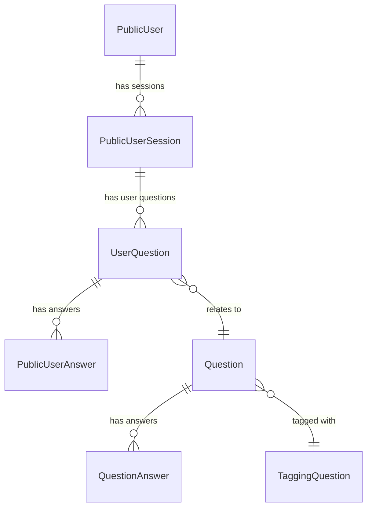

```mermaid
erDiagram
PublicUser ||--o{ PublicUserSession : "has sessions"
PublicUserSession ||--o{ UserQuestion : "has user questions"
UserQuestion ||--o{ PublicUserAnswer : "has answers"
UserQuestion }o--|| Question : "relates to"
Question ||--o{ QuestionAnswer : "has answers"
Question }o--|| TaggingQuestion : "tagged with"
```
